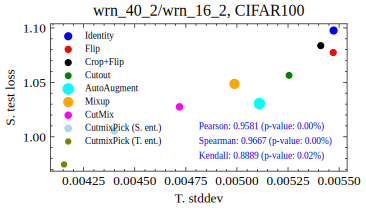
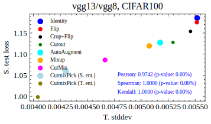
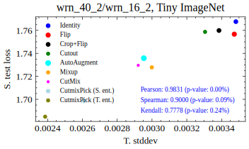
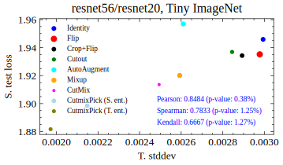
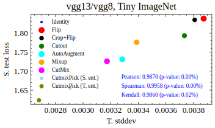

# Good-DA-in-KD
### [Project](https://mingsun-tse.github.io/Good-DA-in-KD/) | [ArXiv](https://arxiv.org/abs/2012.02909) | [PDF](https://arxiv.org/pdf/2012.02909.pdf) | [Slides](https://mingsun-tse.github.io/files/Wang_etal_NeurIPS22_Good_DA_in_KD.pdf)

<div align="center">
    <a></a>
    &nbsp
    <a></a>
</div>

This repository is for our NeurIPS 2022 paper:
> **[What Makes a "Good" Data Augmentation in Knowledge Distillation -- A Statistical Perspective](https://mingsun-tse.github.io/Good-DA-in-KD/)** \
> [Huan Wang](http://huanwang.tech/)<sup>1,2</sup>, [Suhas Lohit](https://suhaslohit.github.io/)<sup>2</sup>, [Michael Jones](https://www.merl.com/people/mjones)<sup>2</sup>, [Yun Fu](http://www1.ece.neu.edu/~yunfu/)<sup>1</sup> \
> <sup>1</sup>Northeastern University <sup>2</sup>MERL \
> Work done when Huan was an intern at MERL.


<details open>
<summary><b>[TL;DR]</b></summary>

- We present a proven proposition to precisely answer "What makes a good data augmentation (DA) in knowledge distillation (KD)?": A good DA should reduce the variance (or covariance) of the teacher-student cross-entropy.
- We present a practical metric that only needs the teacher to measure the "goodness" of a DA in KD: the stddev of teacher’s mean probability
(T. stddev).
- Interestingly, T. stddev works very well in practice (on CIFAR100 and Tiny ImageNet), posing a strong correlation with student’s test loss, despite knowing nothing about the student.
- Based on the theory, we further propose an entropy-based data picking algorithm that can further boost prior SOTA DA scheme (CutMix) in KD.
- Finally, we show how the theory can be utilized in practice to harvest
considerable performance gains simply by using a stronger DA with prolonged training epochs.

</details>

<div align="center">
    <a></a>
    <a></a>
    </br>
</div>

<details open>
<summary><b>Supported Data Augmentation Methods</b></summary>

* [x] Identity
* [x] Flip
* [x] Flip+Crop
* [x] Cutout
* [x] AutoAugment
* [x] Mixup
* [x] CutMix
* [x] CutMixPick (S. ent.) (ours)
* [x] CutMixPick (T. ent.) (ours)

</details>

## Reproducing Our Results


### 0. Download the code
```
git clone git@mingsun-tse.com/Good-DA-in-KD.git
cd Good-DA-in-KD
```

### 1. Download pretrained model (CIFAR100/Tiny ImageNet/ImageNet100)
```bash
sh scripts/set_up_pretrained_models.sh
```

### 2. Set up environment with Anaconda (We use torch 1.9.0, torchvision 0.10.0)
```bash
sh scripts/set_up_env.sh
```

### 3. Run
Here we give the example with vgg13/vgg8 pair on CIFAR100. See `scripts/` for the complete scripts.
```bash
# 

```
Meanwhile, note the major results in our paper are Tabs. 3-8, where we document the T. stddev and S. test loss on 9 teacher-student pairs and 9 DA schemes. Each experiment is averaged at least 3 times. **All the logs of these experiments have been released** (only the log txts are released; checkpoints are omitted due to the large size. But if you want any of these checkpoints, feel free to reach out to Huan Wang (wang.huan@northeastern.edu). 

We use [smilelogging](https://github.com/MingSun-Tse/smilelogging) for logging. Each experiment is binded with a unique experiment ID and folder. The easist way to reproduce any experiment is to check the `log.txt` in that experiment folder. Its path is `<experiment_folder>/log/log.txt`. At the head of the `log.txt`, we document the script of that experiment. E.g.,
```
cd /home3/wanghuan/Projects/KD-DA
CUDA_VISIBLE_DEVICES=1 python train_student.py --dataset tinyimagenet --path_t ./save/models_tinyimagenet_v2/wrn_40_2_vanilla/ckpt_epoch_240.pth --distill kd --model_s wrn_16_2 -r 0.1 -a 0.9 -b 0 --t_output_as_target_for_input_mix --lw_mix [1,0,1] --learning_rate 0 --fix_student --utils.ON --utils.check_ce_var --epochs 10 --mix_mode mixup --project kd__wrn_40_2wrn_16_2__tinyimagenet__CheckTProbStd_mixup

('alpha': 0.9) ('amp': False) ('batch_size': 64) ('bbox': rand_bbox) ('beta': 0.0) ('branch_dropout_rate': [0.0, 0.0, 0.0, 0.0, 0.0, 0.0]) ('branch_layer_S': []) ('branch_layer_T': []) ('branch_width_S': 256) ('branch_width_T': 256) ('cache_ignore': ) ('ceiling_ratio_schedule': ) ('check_cutmix_label': False) ('CodeID': ['f4e606d']) ('crd_multiheads': False) ('cut_size': 16) ('cutmix_pick_criterion': kld) ('cutmix_pick_scheme': sort) ('d_z': 1000) ('DA_pick_base': None) ('dataset': tinyimagenet) ('debug': False) ('distill': kd) ('embed': original) ('entropy_log': None) ('epoch_factor': 0) ('epoch_stop_head_kd_loss': 10000000) ('epochs': 10) ('experiments_dir': Experiments) ('feat_dim': 128) ('finetune_student': ) ('fix_embed': False) ('fix_student': True) ('fix_T_heads': False) ('floor_ratio_schedule': ) ('gamma': 0.1) ('head_init': default) ('hint_layer': 2) ('init_epochs': 30) ('input_mix_no_kld_epoch': 1000000) ('kd_S': 4) ('kd_T': 4) ('learning_rate': 0.0) ('lr_DA': 0) ('lr_decay_epochs': [150, 180, 210]) ('lr_decay_rate': 0.1) ('lw_branch_ce': 0.1) ('lw_branch_kld': 0.9) ('lw_dcs': 0.5) ('lw_mix': [1.0, 0.0, 1.0]) ('mask_zero_ratio': 0.5) ('max_min_ratio': 5) ('mix_mode': mixup) ('mix_n_run': 1) ('mode': exact) ('model_path': ./save/student_model) ('model_s': wrn_16_2) ('model_s_pretrained': None) ('model_t': wrn_40_2) ('model_t_pretrained': None) ('modify_student_input': ) ('momentum': 0.9) ('n_branch_fc_S': 1) ('n_branch_fc_T': 1) ('n_patch': 4) ('n_pick': 64) ('nce_k': 16384) ('nce_m': 0.5) ('nce_t': 0.07) ('no_DA': False) ('num_workers': 8) ('online_augment': False) ('only_test': ) ('path_t': ./save/models_tinyimagenet_v2/wrn_40_2_vanilla/ckpt_epoch_240.pth) ('pretrained_embed': ) ('print_freq': 100) ('print_interval': 100) ('project_name': kd__wrn_40_2wrn_16_2__tinyimagenet__CheckTProbStd_mixup) ('ratio_CE_loss': 1) ('reinit_student': False) ('resume_ExpID': ) ('resume_student': ) ('s_branch_target': t_branch) ('save_crd_loss': False) ('save_entropy_log_step': 0) ('save_freq': -1) ('save_img_interval': 1000000000) ('SERVER': ) ('stack_input': False) ('t_output_as_target_for_input_mix': True) ('tb_freq': 500) ('tb_path': ./save/student_tensorboards) ('test_loader_in_train': False) ('test_teacher': False) ('train_linear_classifier': False) ('trial': 1) ('two_loader': False) ('update_data_interval': 2) ('update_data_start': 100) ('use_DA': 11) ('userip': ) ('utils': <utils.EmptyClass object at 0x7f70a2b187f0>) ('weight_decay': 0.0005) ('weight_decay_schedule': None) 
```
By running that script, you should be able to reproduce our results (results may vary from what we reported within a reasonable range due to randomness).


## Major Experimental Results
We plot the scatter points of student test loss (S. test loss) vs. our proposed metric (T. stddev). Per our proposition, a lower T. stddev should lead to lower S. test loss, i.e., they should pose *positive correlation*. This is verified in all of these plots -- three kinds of positive correlation coeffcients (Pearson, Spearman, Kendall) are presented with their p-values. The p-values are far below 5%, suggesting **the correlation is rather strong**.

<div align="center">
    <a></a>
    <a></a>
    </br>
    <a></a>
    <a></a>
    </br>
    <a></a>
    <a></a>
    </br>
    <a></a>
    <a></a>
    </br>
</div>

Please refer to our paper for more results.

## Acknowledgments
In this code we heavily rely on the wonderful [code of CRD](https://github.com/HobbitLong/RepDistiller). Great thanks to them! We also greatly thank the anounymous NeurIPS'22 reviewers for the constructive comments to help us improve the paper.

## Reference

If our work or code helps you, please consider to cite our paper. Thank you!
```BibTeX
@inproceedings{wang2022what,
  author = {Huan Wang and Suhas Lohit and Michael Jones and Yun Fu},
  title = {What Makes a "Good" Data Augmentation in Knowledge Distillation -- A Statistical Perspective},
  booktitle = {NeurIPS},
  year = {2022}
}
```


